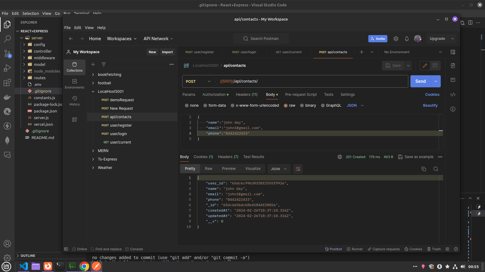
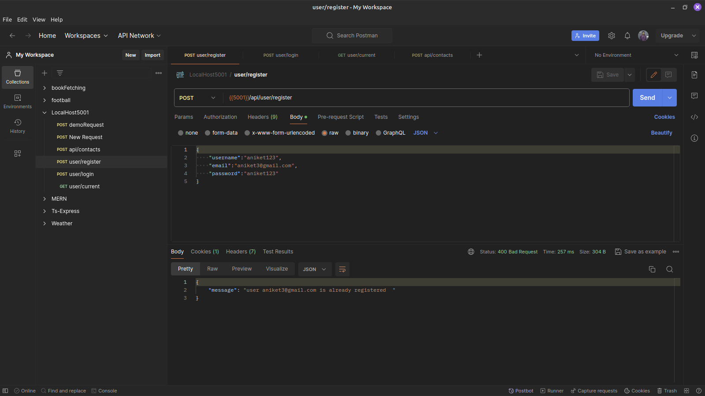

# Contact Manipulation

This Express.js project implements CRUD functionality for contacts, allowing creation, updating, retrieval by ID, and deletion. Authentication is integrated for added security, with data securely stored in MongoDB and passwords encrypted using the bcrypt package.

