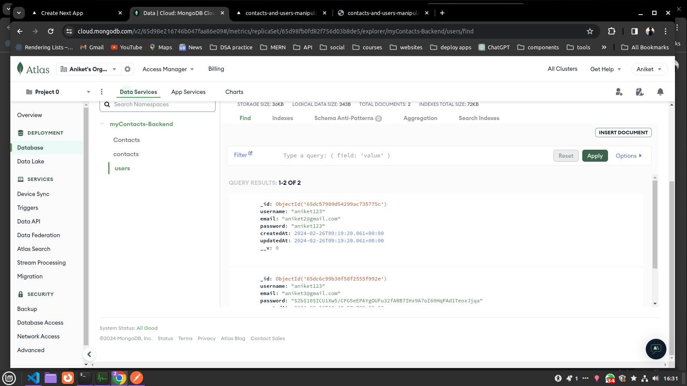
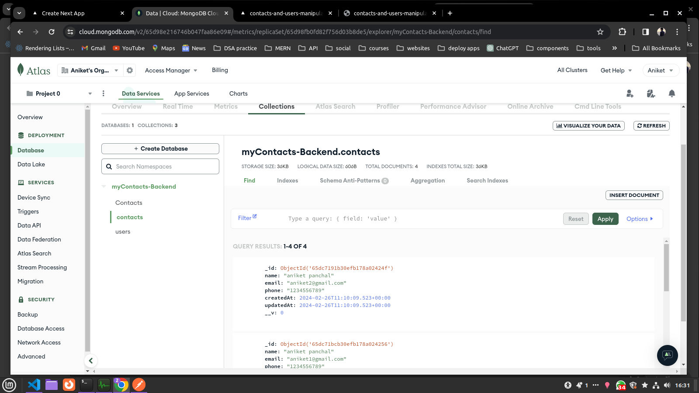
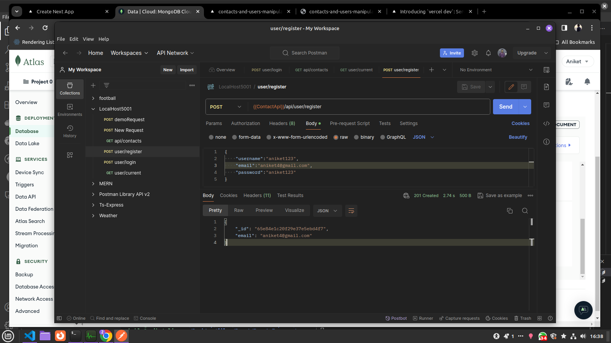
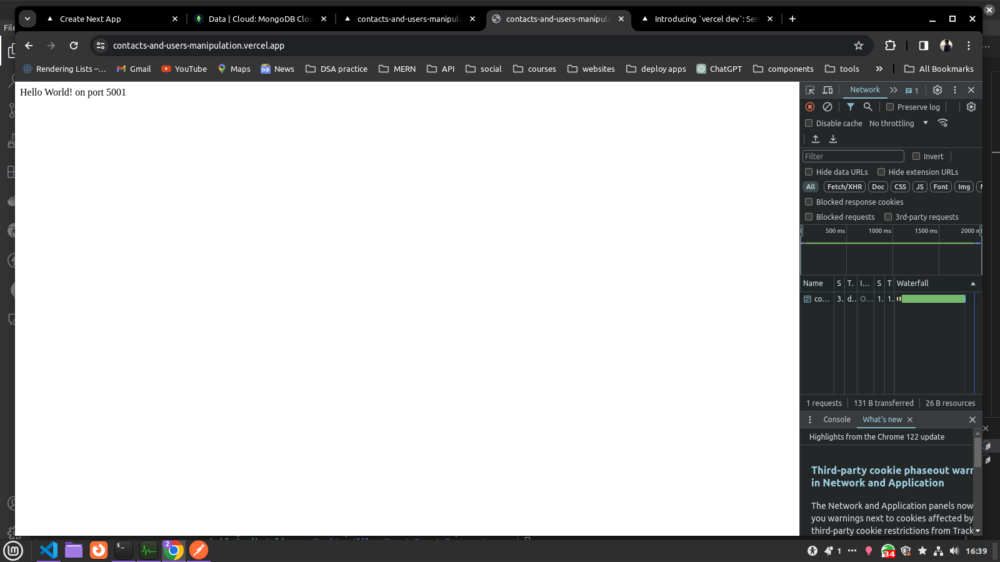

# Contact Manipulation

This Express.js project implements CRUD functionality for contacts, allowing creation, updating, retrieval by ID, and deletion. Authentication is integrated for added security, with data securely stored in MongoDB and passwords encrypted using the bcrypt package.

its update to mongodb database...

API is deployed online on vercel.app so anywhere we can create and edit contact and users 

this is was on local host

